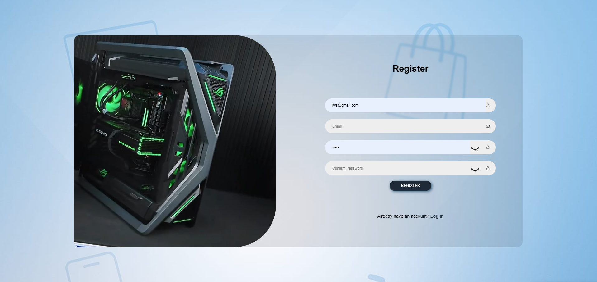
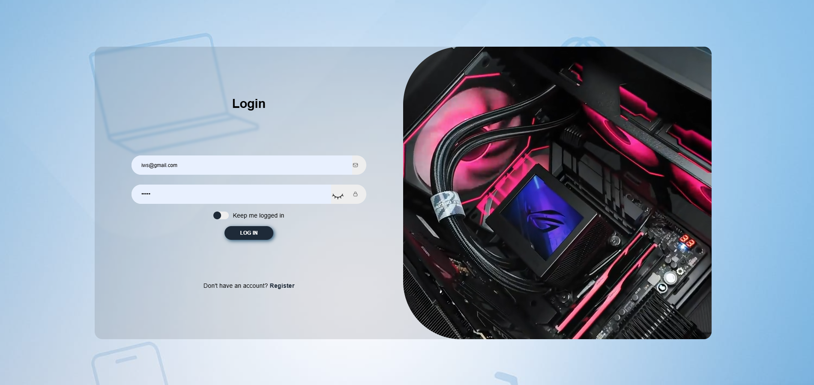
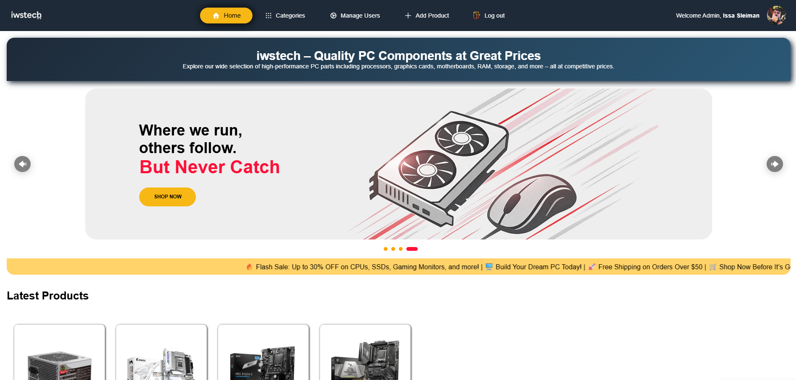
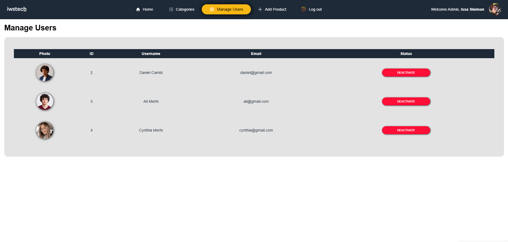
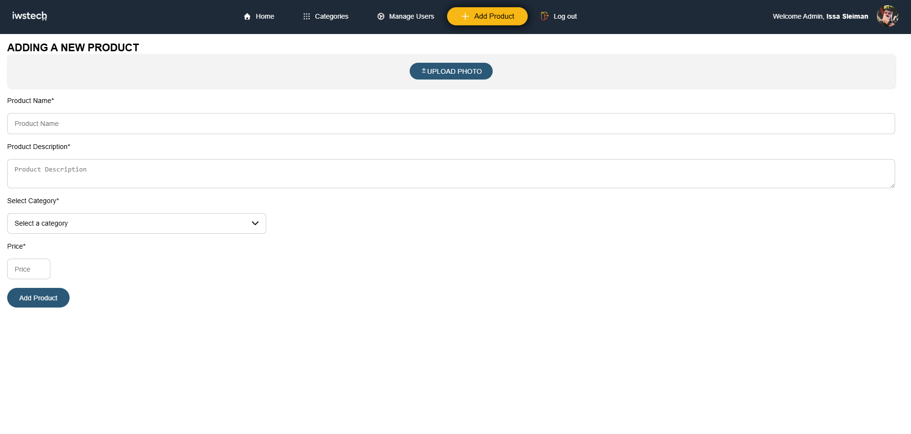
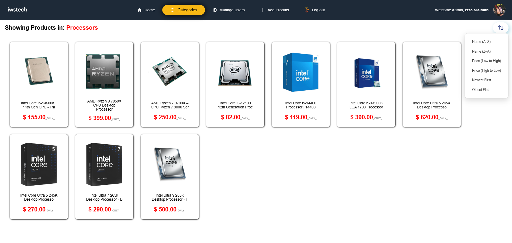

# 💻 iwstech

**iwstech** is a university web development project designed to simulate a simple admin-user platform for managing PC component listings. It demonstrates core concepts of user authentication, admin privileges, and basic CRUD functionality in a web environment.

## 📌 Project Overview

**iwstech** allows:

- 👤 **Users** to sign up, log in, and view PC components
- 🛠️ **Admins** to manage users and moderate listings
- 🔐 Secure user authentication and role-based access control

This project focuses on building a **clean and functional admin-user system** with an intuitive interface and backend logic.

## 🧱 Features

### 👤 User

- Register and log in
- Edit personal profile
- View available PC components
- Browse basic product details

### 🛠️ Admin

- Admin dashboard with overview stats
- View all registered users
- Add, edit, or delete users
- Manage user roles and permissions
- (Optional) Moderate PC component listings

## 🧪 Technologies Used

- **Frontend:** HTML5, CSS3, JavaScript
- **Backend:** PHP
- **Database:** MySQL
- **Authentication:** Session-based
- **Version Control:** Git & GitHub

## ⚙️ Installation & Setup

### 🛠️ INSTRUCTIONS TO MAKE THE WEBSITE FULLY FUNCTIONAL:

1. **Import the database file:**
   - Open **phpMyAdmin** or your preferred **MySQL management tool**.
   - Import the file named: `iwstech_db.sql`.

2. **Final Steps:**
   - Once the import is complete, return to your website directory.
   - Open the website in your browser.
   - **Refresh the page.**

✅ The website should now be **fully functional** with all database content loaded.

### 🔁 Run Locally

1. Clone the repository:
   ```bash
   git clone https://github.com/yourusername/iwstech.git
   cd iwstech


## 📸 Screenshots

### 📝 Register Page



> User registration form with input validation for a seamless sign-up experience.

---

### 🔐 Login Page



> Clean login interface allowing users and admins to securely access the platform.

---

### 🏠 Home Page



> The main landing page displaying featured PC components and navigation options.

---

### 🛠️ Admin – Manage Users Page



> Admin dashboard interface for viewing, editing, and deleting user accounts.

---

### ➕ Admin – Add Product Page



> Admin functionality to add new PC components to the marketplace with form inputs.

---

### 🗂️ Product Listing by Category



> Browse components by category with dropdown filtering and sort options.


